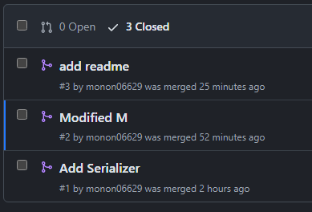
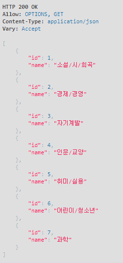
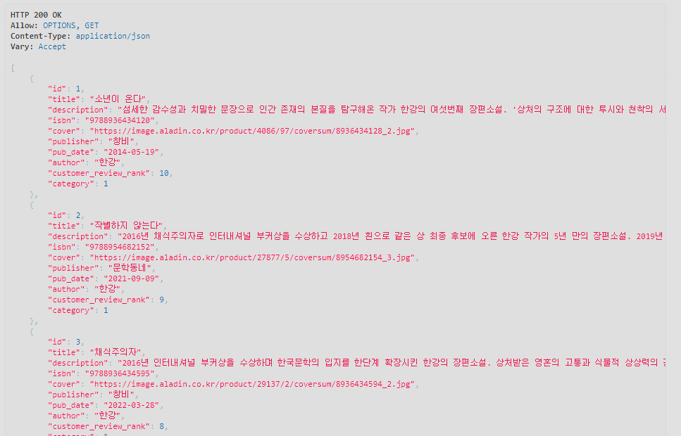
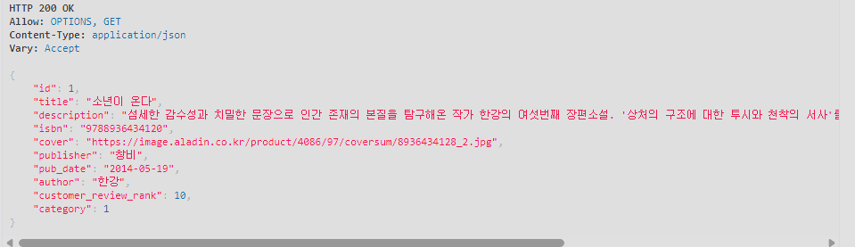
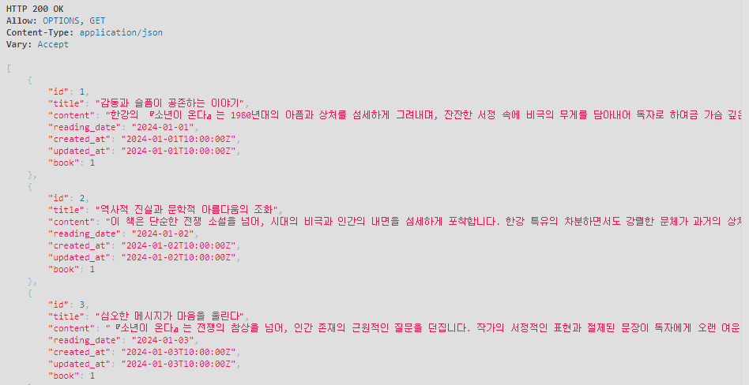
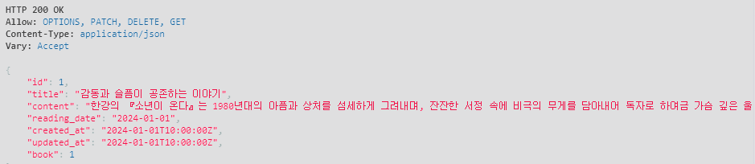
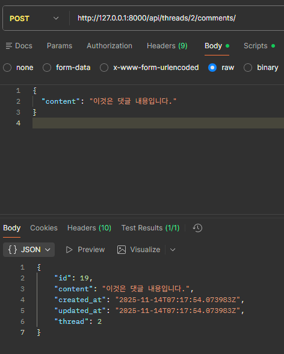
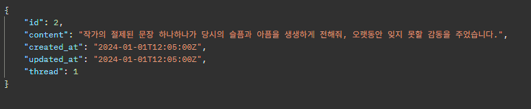

## 1. 초기에 세운 원칙

- git을 사용하여 프로젝트의 분할을 시행해 보기로 했습니다.
- 1.  사용할 변수를 의논하였습니다. (thread, comment, book 그리고 단수와 복수의 사용에 대해서)
- 2.  팀장이 스켈레톤 코드를 작성하면,
  - 2-1. 한 사람은 Serializer와 View함수를 작성했습니다.
  - 2-2. 다른 사람은 Model의 Field를 작성하고, ER을 계획하였습니다.
- 3.  pull 요청 보낸 후 논의, 병합

## 2. 생성했던 Branch 용도 정리

- 개인 이름을 사용한 branch를 사용하였습니다.

  - LIM : Model과 URL작성, ER구성
  - sang : Serialize와 View함수 작성
  - readme : README 작성
  - readme' : 캡쳐 제출파일 수정

## 3. commit들 확인

## 4. 학습한 내용과 어려웠던 점 (소스코드와 캡쳐본)

- Serializer를 사용한 view함수 구성

  - 처음에는 데이터를 파싱하여 딕셔너리 자료형으로 묶은 뒤 그 값을 JSON으로 변환하는 함수를 따로 정의하여 구현하려 했습니다. 하지만 Serailizer를 사용하니, 코드의 양이 눈에 띄게 줄어듦을 확인할 수 있었습니다. (JSON, HTTP관련 데코레이터나 메서드의 사용이 감소, 변환하는 함수를 정의하던 부분이 삭제)

  - Serializer를 사용할 때 Badrequest, Internel Server Error가 발생하는 경우가 많았습니다. 특히 해당키가 외래키를 참조하고 있을 때, PUT을 사용할 때 이러한 오류가 발생하는 경향이 많았습니다. 이를 read_field_only와 PATCH를 사용하여 해결할 수 있었습니다.

- Model의 구성과 각 class안에 있는 변수들이 가지는 관계
  - ForeignKey는 일대다 관계를 나타내는데, 다수의 객체가 하나의 객체를 참조할 때 사용하는 구조라서 실수 한 번 할 때마다 많이 틀어지거나, 오류가 나거나 했었습니다. 그러다가 author = models.ForeignKey(Author, on_delete=models.CASCADE)를 사용하여 다대일 관계를 설정할 수 있었습니다.

## 5. 느낀 점

본격적으로 git을 사용해서 작업을 진행하였습니다. 처음에는 가벼운 약속으로 진행하였습니다.

> 1. main에 직접 수정하지 말기
> 2. 중복되는 부분 수정하지 말기
> 3. 변수나 bramch 이름 등을 명확하게 하기

하지만 같이 수행하다 보니 생각보다 더 많은 규칙사항들이 필요함을 느낄 수 있었습니다. commit 취소하기나 되돌리기, 실수로 main에 작업하였을 경우 어떻게 해야하는지, merge 옵션은 어떻게 설정할 것인지에 대한 것들 등 고려해야할 사항이 많다는 것을 알 수 있었습니다.

또한, 처음에는 git branch를 처음으로 응용해보았는데, 익숙지 않아서 pull이나 merge를 실행하는 과정에서 실수를 많이 했습니다.
그래도 시간이 지나고 자주 쓰다보니까 시스템에 대해 이해도 되고 적응하게 되어 다음 협업이 진행할 때에는 능숙하게 할 수 있을 것 같습니다.

## 6. 캡처 화면

A. category_list

B. book_list

C. book_detail

D. thread_list

E. thread_detail

G. create_comment

H. comment_detail

